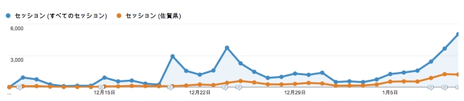
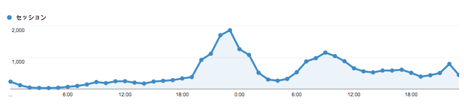
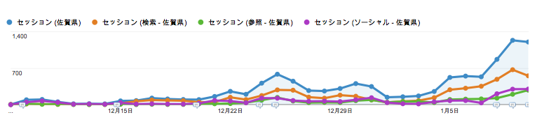
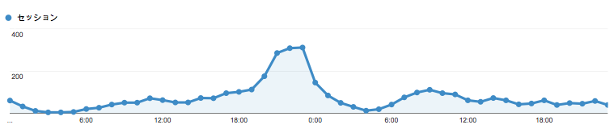
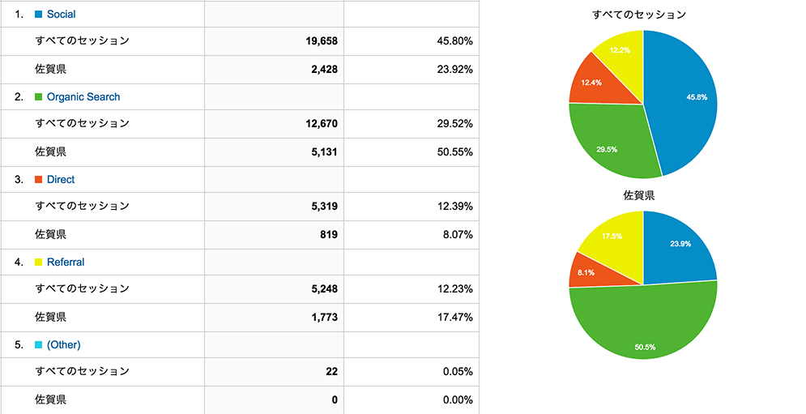
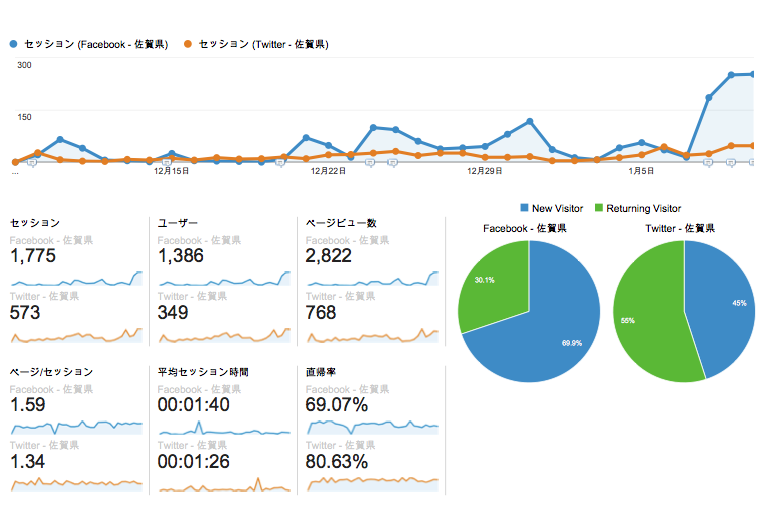
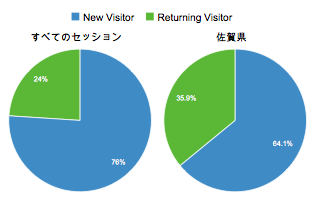
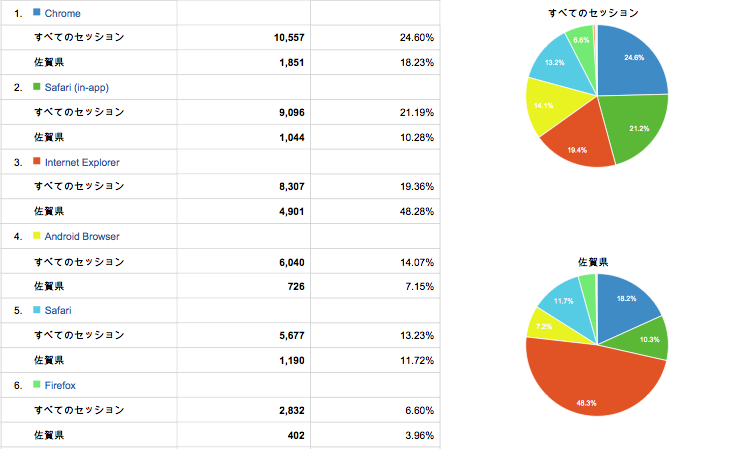
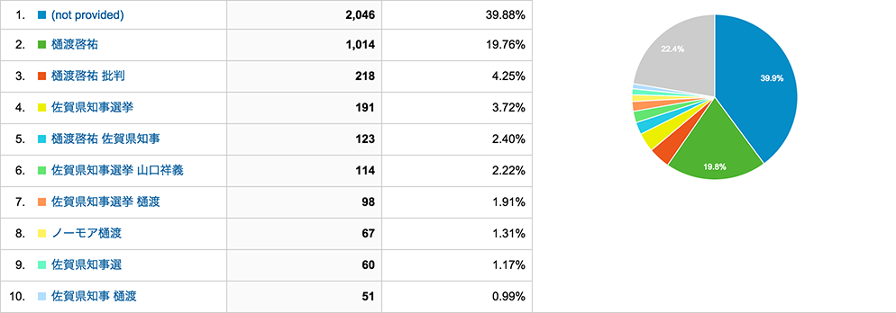

/*
Title: nomore-hiwatashi.com のアクセス動向からみる佐賀県知事選挙
Description: nomore-hiwatashi.com は2015年1月11日に投開票が行われた佐賀県知事選挙において、特定の立候補者についての懸念事項をまとめたサイトでした。
Author: nojimage
Robots: index,follow
*/

nomore-hiwatashi.com[^1] へのアクセスの解析結果を置いておきます。
なお、アクセス解析には Google Analytics を使用しています。

[^1]: nomore-hiwatashi.com は2015年1月11日に投開票が行われた佐賀県知事選挙において、特定の立候補者についての懸念事項をまとめたサイトです。

## 概要

1. [佐賀県内] 投票日前日までに 6,702 ユーザー（有権者数の1%弱）が閲覧
2. [佐賀県内] 流入は半数が検索経由によるもの。ソーシャル(Facebook, Twitter)による流入は少ない。
3. [佐賀県内] 全体にくらべPCブラウザでの閲覧が多い
4. [佐賀県内] 全体にくらべ新規ユーザー率が低い（再訪問率が高い）
5. [全体] 投票日に近づくにつれ検索による流入が増加
6. [全体] 投票終了後に検索からのアクセスが大幅増加
7. [全体] 選挙運動期間より投票締切後にアクセスが集中する

## 全体のアクセス

サイト公開から投票日前日までの総アクセス数は `42,917 セッション` / `32,612 ユーザー` でした。

*公開(2014/12/8)から投票日前日(2015/1/10)までの動向（日別）*

*投票日および投票日翌日の動向（時間別）*

### イベント/ピーク

- 12/9: Twitterなどで告知 [ツイート](https://twitter.com/nojimage/status/544634988218445826)
- 12/15: Twitterで高木浩光氏(@HiromitsuTakagi)が告知ツイートをリツイート
- 12/20: はてぶホッテントリ入り
- 12/24: やまもといちろう氏(@kirik)が[ツイート](https://twitter.com/kirik/status/547651373115146240) 
- 12/25: 佐賀県知事選挙 公示
- 1/11: 佐賀県知事選挙 投開票 (20:00投票締切、22:30頃当確発表)

## 佐賀県内からのアクセス

| 期間  | ユーザー | セッション |
|:------------- | ---------------:| -------------:|
| サイト公開から投票日前日まで | 6,702 | 10,151 |
| - サイト公開から公示日前日まで | 1,387 | 1,903 |
| - 公示日から投票日前日まで | 5,718 | 8,248 |
| 投票日当日(20:00まで) | 792 | 990 |
| 投票日当日(20:00以降) | 1,070 | 1,079 |

*佐賀県 公開(2014/12/8)から投票日前日(2015/1/10)までの動向（日別）*

*佐賀県 投票日および投票日翌日の動向（時間別）*

### アクセス推移について

佐賀県内からのアクセスは、公示日前後（12/24,25）と投票日前（1/8〜）に増加傾向がみられます。

また、投票日においては投票終了時刻前からアクセスが集中しています。

### サイトへの流入

投票日前日までにおいて、50.5%が検索、23.9%がソーシャル(Facebook,Twitter)、17.5%が他サイトのリンクから、残りが直接アクセスとなっています。

全体にくらべ`県内からのアクセスは、検索経由が多く、ソーシャル経由が少ない`結果になっています。

### ソーシャル比率

佐賀県内では投票日前日までにおいて、Twitter（573セッション）よりFacebook（1,775セッション）経由の流入が多くなっています。

### リピーター率

サイトへの再訪問率は、`佐賀県内では35.9%と全体(24%)に比べ高く`なっています。

また、ソーシャルネットワークによる流入、特にTwitterではリピーター率が高い結果になっています。

### ブラウザ

IEの比率が48.28%と全体（19.4%）に比べ高くなっています。かわりに携帯端末のブラウザが少なくなっています。

### 検索キーワード

## アクセス動向からみる考察

### 当サイトへの流入について

佐賀県内と全体を比べた場合、ソーシャル経由のアクセスが少なく検索経由でのアクセスの比率が多くなっています。また、携帯端末よりもPCブラウザからのアクセスが多くなっています。

これは佐賀県では、電車などの公共交通機関で移動する人より車で移動する人が多いため、移動時間中にネットに触れる機会が少ないためと考えられます。

また、知事選は生活に関わる事項のため能動的に検索してたどり着いた人が多いとも考えられます。

検索キーワードについては、サイト自体を「樋渡啓祐」で上位表示されるよう文章を構成していましたので、そのキーワードによる流入が多くありました。

### 当サイトの及ぼした影響について

佐賀県内からのアクセスは投票日前日までで、`有権者数の1%弱、6,702ユーザーという結果`でした。今回の知事選の投票者数は369,114票でしたので、サイトを見た人全てが投票に行ったと仮定した場合で、1.8%程度へ影響を与えたと考えられます。

ただし、県内からはサイトへの再訪問率が高いことから、一度サイトを見た人が家族、親戚、知人など他の人にも紹介したケースが考えられます。

#### 対立陣営でのサイトの利用

今回の選挙は、ほぼ樋渡氏、山口氏の一騎打ちの構図でした。

Facebook上では、山口氏を応援していた市議や首長が当サイトに言及しているのを確認しています。1月8日ごろからFacebookからの流入が増えていますが、これはそのあたりからのシェアによる拡散ではないかと考えています。

## まとめ

今回の選挙では組織による選挙活動が主であり、ネット上の情報はあくまでその活動を補完するための道具として利用されたというのが実際のところでしょう。

佐々木氏の出馬断念から山口氏の擁立にいたる一連の経緯をみてもわかるように、元々佐賀県内では樋渡氏の政治手法や結果について違和感や疑問を感じている人は多くいました。

これら違和感や疑問をもつ人が、たけお問題に関わる方々によってまとめられた様々な情報や当サイトに触れることによって、疑問を確信に変え、樋渡氏以外の候補に投票したり、家族、親戚、知人などへその問題を知らせるためにネット上の情報を利用したと考えています。

実際のところ「ネット上の情報が投票にどう影響を与えたか」については個人での検証には限りがありますので、できればメディアに取材を行ってもらい明らかにして欲しいと願っています。

また、知事選は終わりましたが、武雄市の市政についての問題は未だ情報も開示されていない部分が多く、解決とはほど遠い状態です。引き続き関心を寄せ、全容を明らかにする必要があると考えています。

-----

最後に、nomore-hiwatashi.com は、`#たけお問題` に関わっている方々、情報公開で開示された文書を共有して頂いている方々、サイト等にて情報をまとめていただいている方々のこれまでの活動がなければ作ることができませんでした。改めてお礼申し上げます。

<a href="assets/reports.zip" class="btn btn-primary text-center"><i class="fa fa-download"></i> レポートのダウンロード</a> 
 (PDF/zip圧縮 2.1MB)

## 他の方の振り返り・考察

- [佐賀県知事選挙、暗黙の常識と「ツイッター学会会長」が負けた必然：坂本英樹の繋いで稼ぐBtoBマーケティング：ITmedia オルタナティブ・ブログ](http://blogs.itmedia.co.jp/sakamoto/2015/01/saga-gov.html)

- [行って、見て、読んだー本に関するメモランダム: [番外編] 2015年佐賀県知事選を振り返って](http://mdsch23books.blogspot.jp/2015/01/2015.html)

- [佐賀県知事選とネット選挙(上) 違和感が人を集めた～ひまじんうんことYahoo!ブリーフケース - 高圧☆洗浄機](http://nukalumix.hateblo.jp/entry/himajinunko001)
- [佐賀県知事選とネット選挙(中) 違和感を解き明かす～ネットで政治は動かない - 高圧☆洗浄機](http://nukalumix.hateblo.jp/entry/himajinunko002)
- [佐賀県知事選とネット選挙(下) 違和感を共有した～ネット選挙の現実 - 高圧☆洗浄機](http://nukalumix.hateblo.jp/entry/himajinunko003)

- [サーバ管理者日誌 シリーズ佐賀県知事選挙を振り返る(1) - はじめに](https://www.nantoka.com/~kei/diary/?20150113S1)
- [サーバ管理者日誌 シリーズ佐賀県知事選挙を振り返る(2) - 告示前](https://www.nantoka.com/~kei/diary/?20150114S1)
- [サーバ管理者日誌 シリーズ佐賀県知事選挙を振り返る(3) - 選挙戦突入](https://www.nantoka.com/~kei/diary/?20150116S1)
