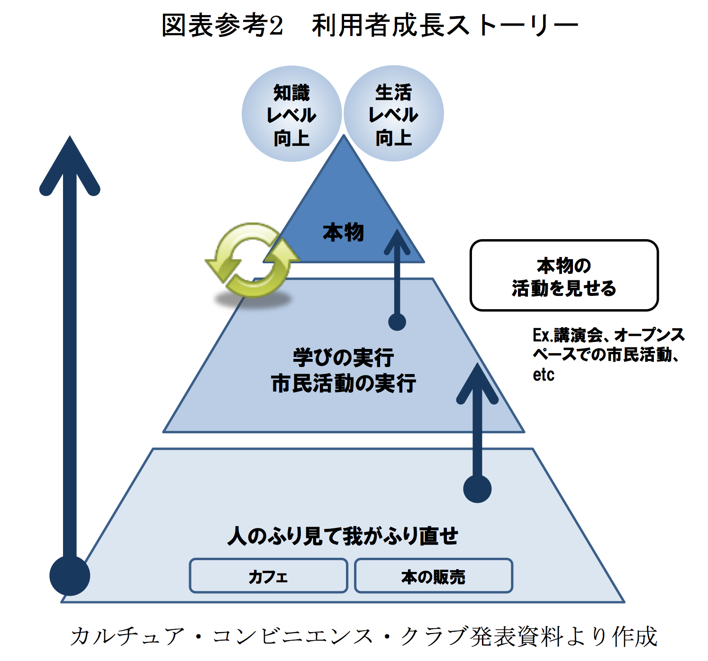

/*
Title: CCCは公の事業に関わる資格がない
Author: nojimage
Description: 
Keywords: CCC,TSUTAYA,図書館,武雄市,指定管理者,公共事業
*/

# CCCは公の事業に関わる資格がない

出典: [平成26年度指定管理者実務研究会報告書 p.27](http://shitekan.furusato-ppp.jp/wp-content/uploads/2014/08/%E5%B9%B3%E6%88%9026%E5%B9%B4%E5%BA%A6%E6%8C%87%E5%AE%9A%E7%AE%A1%E7%90%86%E8%80%85%E5%AE%9F%E5%8B%99%E7%A0%94%E7%A9%B6%E4%BC%9A%E5%A0%B1%E5%91%8A%E6%9B%B8.pdf#page=27)

武雄市図書館をはじめとした図書館[^ccc_libraries]の指定管理者となった、CCC（カルチュア・コンビニエンス・クラブ株式会社、TSUTAYAを運営）について、興味深い資料がありましたのでまとめてみたいと思います。

一般財団法人地域総合整備財団＜ふるさと財団＞[^furusato]の運営する「指定管理者info[^siteiinfo]」というWebサイトに「平成26年度指定管理者実務研究会報告書」という資料があり、その中に指定管理者の導入事例として武雄市図書館[^p20]がでてきます。

さらにその参考資料として「[武雄市図書館の取組み事例 〜第3回研究会でのカルチュア・コンビニエンス・クラブ(株)発表より〜](http://shitekan.furusato-ppp.jp/wp-content/uploads/2014/08/%E5%B9%B3%E6%88%9026%E5%B9%B4%E5%BA%A6%E6%8C%87%E5%AE%9A%E7%AE%A1%E7%90%86%E8%80%85%E5%AE%9F%E5%8B%99%E7%A0%94%E7%A9%B6%E4%BC%9A%E5%A0%B1%E5%91%8A%E6%9B%B8.pdf#page=27)」という資料があります。
武雄市図書館において初めて指定管理者となったCCCの考えが表れていました。

## CCC:「情報公開請求によるノウハウ流出リスクが大きな問題であると感じている」

    1 情報公開請求の問題  
    まず、情報公開請求によるノウハウ流出リスクが大きな問題であると感じている。住民から請求があれば、行政は情報公開せざるを得ない。弊社のノウハウである図面、書架配置図がネット上にUPされるリスクがある。また、公募エントリー資料も不特定多数に閲覧される可能性があり、ノウハウ流出リスクを常に抱えている状態である。

出典: [平成26年度指定管理者実務研究会報告書 p.24](http://shitekan.furusato-ppp.jp/wp-content/uploads/2014/08/%E5%B9%B3%E6%88%9026%E5%B9%B4%E5%BA%A6%E6%8C%87%E5%AE%9A%E7%AE%A1%E7%90%86%E8%80%85%E5%AE%9F%E5%8B%99%E7%A0%94%E7%A9%B6%E4%BC%9A%E5%A0%B1%E5%91%8A%E6%9B%B8.pdf#page=27)

こちらについては既に「[CCCにとって情報公開法は都合が悪い | Do Not Track Me !](https://donottrackme.wordpress.com/2015/08/14/ccc%E3%81%AB%E3%81%A8%E3%81%A3%E3%81%A6%E6%83%85%E5%A0%B1%E5%85%AC%E9%96%8B%E6%B3%95%E3%81%AF%E9%83%BD%E5%90%88%E3%81%8C%E6%82%AA%E3%81%84/)」にて指摘されている通りで、行政文書開示請求の根拠である「行政機関の保有する情報の公開に関する法律」の目的[^H11HO042-1]を無視した考えです。

    要約すると、「行政機関の保有する情報の公開に関する法律を根拠法として各地方自治体が制定した情報公開条例に基づく国民の権利である行政文書開示請求が嫌で仕方がない」そうだ。
    （…中略…）
    つまり、カルチュア・コンビニエンス・クラブ株式会社は非上場企業であるために企業活動の詳細を公開する義務を負っていないゆえに、企業活動のすべてにおいて隠蔽を旨とした企業体質が浸透しており、日本法に反することを是とすることを自白したに等しい。

引用元: [CCCにとって情報公開法は都合が悪い | Do Not Track Me !](https://donottrackme.wordpress.com/2015/08/14/ccc%E3%81%AB%E3%81%A8%E3%81%A3%E3%81%A6%E6%83%85%E5%A0%B1%E5%85%AC%E9%96%8B%E6%B3%95%E3%81%AF%E9%83%BD%E5%90%88%E3%81%8C%E6%82%AA%E3%81%84/)

情報公開請求への対応が嫌であれば、公の事業に関わらなければよいのです。

なお、武雄市図書館については情報公開請求によって、図書購入や廃棄の問題など武雄市とCCCの杜撰な図書館運営体制[^yahoonews]が明らかになりつつあります。  
また、この考えに基づくものか、武雄市が市民からの情報公開請求を遅延させたり応じなかったため、訴訟問題[^saga-s-208125]に発展しています。

## 

### 参考サイト

- [指定管理者実務研究会報告書(平成25年度～平成26年度) | 指定管理者info](http://shitekan.furusato-ppp.jp/?article=%E6%8C%87%E5%AE%9A%E7%AE%A1%E7%90%86%E8%80%85%E5%AE%9F%E5%8B%99%E7%A0%94%E7%A9%B6%E4%BC%9A%E5%A0%B1%E5%91%8A%E6%9B%B8%EF%BC%88%E5%B9%B3%E6%88%9025%E5%B9%B4%E5%BA%A6%EF%BC%89&dest=research&menuname=%E7%A0%94%E7%A9%B6%E4%BA%8B%E6%A5%AD&catname=%E6%8C%87%E5%AE%9A%E7%AE%A1%E7%90%86%E8%80%85%E5%AE%9F%E5%8B%99%E7%A0%94%E7%A9%B6%E4%BC%9A%E3%81%AB%E3%81%A4%E3%81%84%E3%81%A6) 

### 注釈

[^ccc_libraries]: 現在CCCが図書館に関わるとして決定また予定されている自治体は、
    佐賀県武雄市、
    宮城県多賀城市、
    神奈川県海老名市（TRCとの共同）、
    山口県周南市、
    山口県岩国市、
    大阪府松原市、
    愛知県小牧市、
    宮崎県延岡市、
    岡山県高梁市、
    大阪府枚方市 です。

[^furusato]: [一般財団法人地域総合整備財団＜ふるさと財団＞](http://www.furusato-zaidan.or.jp/)

[^siteiinfo]: [指定管理者info](http://shitekan.furusato-ppp.jp/?dest=index) 

[^p20]: [平成26年度指定管理者実務研究会報告書 p.20](http://shitekan.furusato-ppp.jp/wp-content/uploads/2014/08/%E5%B9%B3%E6%88%9026%E5%B9%B4%E5%BA%A6%E6%8C%87%E5%AE%9A%E7%AE%A1%E7%90%86%E8%80%85%E5%AE%9F%E5%8B%99%E7%A0%94%E7%A9%B6%E4%BC%9A%E5%A0%B1%E5%91%8A%E6%9B%B8.pdf#page=24)

[^p23]: [平成26年度指定管理者実務研究会報告書 p.20](http://shitekan.furusato-ppp.jp/wp-content/uploads/2014/08/%E5%B9%B3%E6%88%9026%E5%B9%B4%E5%BA%A6%E6%8C%87%E5%AE%9A%E7%AE%A1%E7%90%86%E8%80%85%E5%AE%9F%E5%8B%99%E7%A0%94%E7%A9%B6%E4%BC%9A%E5%A0%B1%E5%91%8A%E6%9B%B8.pdf#page=27)

[^H11HO042-1]: > 第一条 この法律は、国民主権の理念にのっとり、行政文書の開示を請求する権利につき定めること等により、行政機関の保有する情報の一層の公開を図り、もって政府の有するその諸活動を国民に説明する責務が全うされるようにするとともに、国民の的確な理解と批判の下にある公正で民主的な行政の推進に資することを目的とする。  

    出典: [行政機関の保有する情報の公開に関する法律](http://law.e-gov.go.jp/htmldata/H11/H11HO042.html)

[^yahoonews]: [武雄市図書館 市民からの疑惑(2015年9月3日(木)掲載) - Yahoo!ニュース](http://news.yahoo.co.jp/pickup/6173051)

[^saga-s-208125]: [武雄市図書館の業務委託は違法　市民が提訴｜佐賀新聞LiVE](http://www.saga-s.co.jp/news/saga/10101/208125)